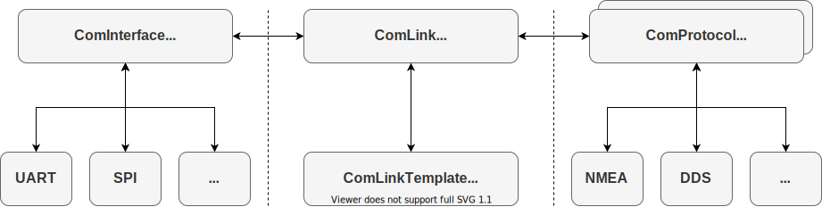

# Plat4m ComInterface Module

## Background

The ComInterface Module was designed to cleanly abstract any communication interface that is capable of bi-directional communication including UART / serial port, SPI, I2C, CAN, etc. It's designed to work closely with the ComLink and ComProtocol classes to provide a very flexible paradigm for sending and receiving bytes, buffering them, and parsing and handling messages.

## Driver Design

ComInterface and its associated sister classes, ComLink and ComProtocol, interact this way:

A few key items to note are:

- The ComInterface class and its derivatives don't allocate their own buffers. This is due to the fact that necessary buffer length is highly dependent on the protocol being used which, in turn, is highly dependent on the application. ComLinkTemplate makes allocating custom transmit and receive buffers easy.
- Multiple ComProtocols can be supported by a single ComInterface. However, care must be taken when having multiple protocols enabled simultaneously as many will conflict with each other.
