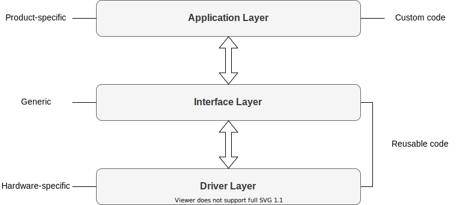
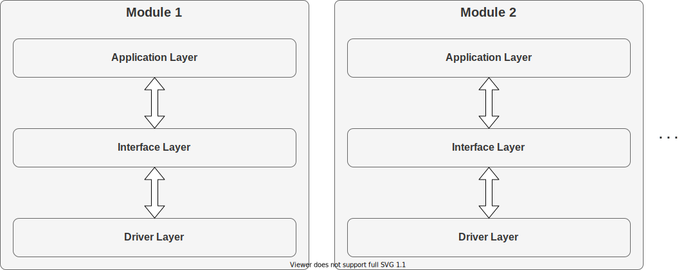
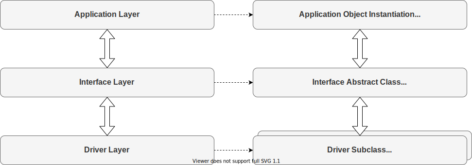
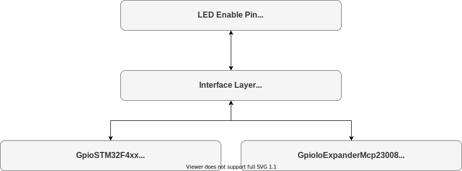

# Plat4m Detailed Design

## Modular Design

All code in Plat4m is organized around the concept of modules. In the context of Plat4m,

__*a Module is a self-contained collection of code that maintains its own state and is interacted with through an API*__.

The most obvious and natural implementation choice for a module is a class. This is one of the most important driving factors for the choice of C++ in Plat4m. While classes can created manually in C, C++ classes are much cleaner, prettier, and safer.

## Layered Design

### Concept

Plat4m uses a layered design pattern to separate product-specific, generic, and hardware-specific code within the context of a single module. The three basic layers are:

1. Application Layer
1. Interface Layer
1. Driver Layer

The three layers relate to each other in the following way:

It's important to note that these layers are not a monolithic API that spans across the entire Plat4m framework. Rather, they are defined independently for each module. For example, Modules 1 and 2 shown below each define their own Application, Interface, and Driver Layers:

This is true of all Plat4m modules and  is important because it means that:

- Each module is independent of each other
- The incurred resource cost of the Plat4m framework scales with each module's usage
- You don't pay a worst-case resource penalty in an all-or-nothing way like in other frameworks

### Implementation

The C++ implementation of these layers in Plat4m uses __*polymorphism*__. Key benefits of this approach include:

- One interface can be represented concurrently by an infinite number of different drivers
- Modules can be stored and interacted with through a reference to their generic interface / parent class, rather than their driver / child class

This greatly increases the flexibility of the modules in how they can be used in a defined, generic way. Here is what each corresponding Plat4m layer relates to in C++:

### Example

Taking this concept one step further, in an embedded system a module representing an LED in Plat4m might look like this:

